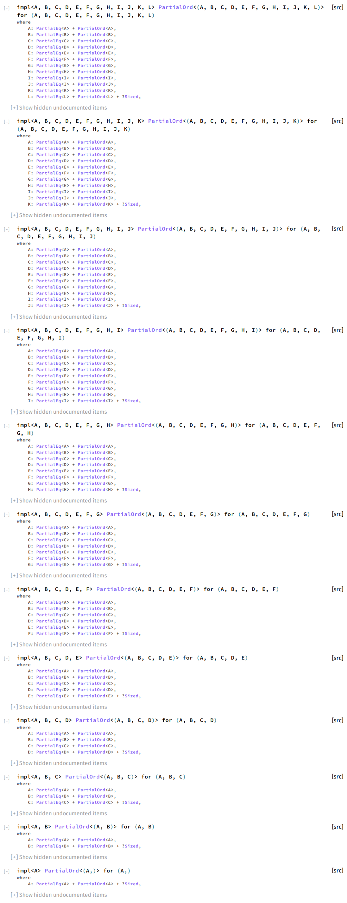
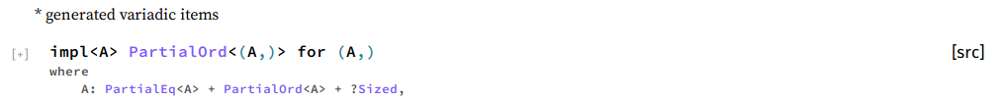

Rust doc is too verbose
=======================

It collapses generated variadic generics in Rust docs to make it concise.
Rust doesn't have a variadic generic.
So `std` mimics it with the macro. They aren't hidden nor collapsed in the doc.
It makes the doc too verbose and navigating it too hard.
That's why I've made this. 

## Demo

### Before

<details><summary>Do you really wanna see the tremendous amount of generated code pieces?</summary>
<p>



</p>
</details>

### After



* the label is collapsable.

## How to build or run

It is a standard `web-ext` package with typescript. I have a `Makefile` for the common workflows.
```
npm install
make build
make run
```
